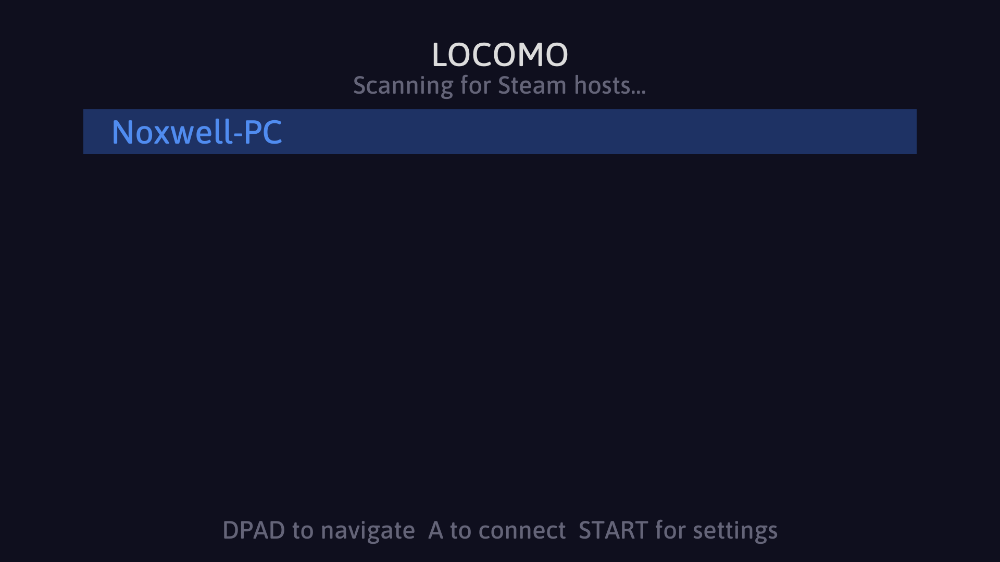
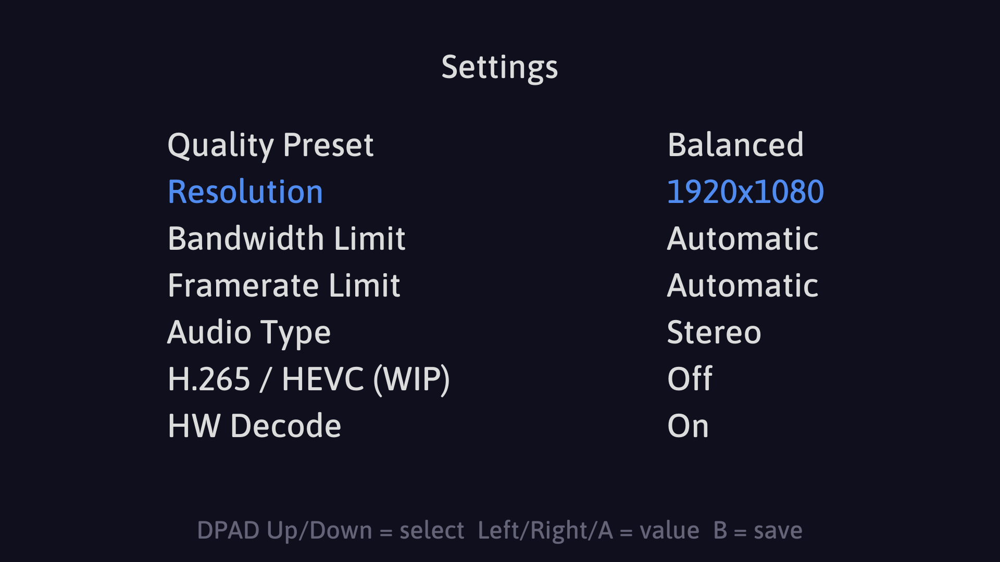

# Locomo - Simple Steam Streaming for Retro Handhelds

Locomo is a minimal Steam Remote Play client designed for ARM64 Linux handhelds. It implements the Steam In-Home Streaming protocol via [ihslib](https://github.com/beebono/ihslib) and is built in Zig.





## Features

- Host discovery and PIN-based pairing
- H.264 and HEVC video streaming
- Hardware-accelerated decoding via V4L2 M2M, V4L2 Request API, and Rockchip MPP
- AAC and Opus audio
- Gamepad input passthrough via SDL HID
- Software mouse mode for cursor control from an analog stick
- In-app settings screen (no config file editing required)

## Requirements

### Runtime

- ARM64 Linux (aarch64)
- VPU hardware for video decoding (software decoding also available)
- EGL and OpenGL ES 2.0 for zero-copy DRM frame rendering
- `libSDL2` available on the system
- A Steam host on the same local network with Remote Play enabled

### Build (Docker path - recommended)

- Docker
- `bash`

### Build (native / manual path)

- Zig 0.16.0
- `cmake`, `make`, `nasm`, `pkg-config`, `autoconf`, `automake`, `libtool`, `meson`, `ninja-build`
- ARM64 sysroot with: `libdbus`, `libibus`, `libegl`, `libgles`, `libgbm`, `libpulse`, `libwayland`, `libxkbcommon`

## Building

### Clone

```sh
git clone --recurse-submodules https://github.com/beebono/locomo.git
cd locomo
```

### Docker (cross-compile for aarch64 - recommended)

```sh
./scripts/docker-build.sh
```

This builds a Docker image with the full cross-compilation toolchain, bootstraps all library dependencies, then compiles locomo. The output binary is placed at:

```
./zig-out/bin/locomo
```

To target a different architecture, set `TARGET` before running:

```sh
TARGET=aarch64-linux-gnu ./scripts/docker-build.sh
```

Please note this is unlikely to work for targets other than aarch64 at the moment!

### Native (on-device or with a matching sysroot)

```sh
./scripts/bootstrap.sh
zig build -Doptimize=ReleaseFast
```

The bootstrap script compiles all bundled library dependencies (mbedTLS, protobuf-c, SDL2, SDL2\_ttf, udev-zero, Rockchip MPP, FFmpeg) and installs them into `./libs/`. This only needs to run once, or after a clean.

## Usage

Copy `locomo` to your device and run it. On first launch it generates a device identity in a `config/` directory next to the binary.

### Navigation

Locomo is fully controller-driven. Use D-pad to move, **A** to confirm, **B** to go back.

**Host scan screen:**
- D-pad up/down - move cursor
- **A** - connect to selected host (pairs if not yet paired, otherwise streams directly)
- **Start** - open settings
- **B** - confirm quit prompt

**Pairing:**  
A 4-digit PIN is displayed. Enter it in Steam on the host when prompted, or under *Settings → Remote Play → Pair Steam Link*.

**During streaming:**
| Chord | Action |
|---|---|
| Start + Select, then X × 2 | Disconnect and return to menu |
| Start + Select + L3 | Toggle mouse mode |

In mouse mode the left stick moves the cursor and the right trigger acts as a click. You can also use the right stick to scroll content.

## Settings

Open the settings screen from the host scan with **Start**. Navigate rows with D-pad up/down, change values with D-pad left/right or **A**. Press **B** or **Start** to save and return.

| Setting | Options |
|---|---|
| Quality | Fast / Balanced / Beautiful |
| Resolution | Native (screen size), or fixed 16:9: 852×480 up to 3840×2160 |
| Bandwidth | Automatic, or fixed: 5–100 Mbps / Unlimited |
| Audio | No Audio / Mono / Stereo |
| Framerate | Automatic / 30 / 60 / 120 / 240 FPS |
| HEVC | Off / On |
| HW Decode | Off / On (requires V4L2 or Rockchip MPP) |
| Button Swap | None / Swap A-B / Swap X-Y / Swap All |

Settings are saved to `config/settings.json` next to the binary.

## Configuration Files

All state is stored in a `config/` directory alongside the binary:

| File | Contents |
|---|---|
| `device.json` | Device identity (ID, secret key, name), auto-generated |
| `paired.json` | Paired host info, written after successful pairing |
| `settings.json` | User settings, written when leaving the settings screen |

Delete `paired.json` to unpair from the current host.

## Dependencies (bundled via submodules)

| Library | Purpose |
|---|---|
| [ihslib](https://github.com/beebono/ihslib) | Steam IHS protocol implementation |
| [SDL2](https://github.com/libsdl-org/SDL) | Window, renderer, gamepad input |
| [SDL2\_ttf](https://github.com/libsdl-org/SDL_ttf) | Font rendering for the UI |
| [FFmpeg 8.1](https://ffmpeg.org) | Video/audio demuxing and decoding |
| [Rockchip MPP](https://github.com/rockchip-linux/mpp) | Hardware video decoding on Rockchip SoCs |
| [mbedTLS](https://github.com/Mbed-TLS/mbedtls) | Cryptography (stream encryption) |
| [protobuf-c](https://github.com/protobuf-c/protobuf-c) | Protobuf serialization for the IHS protocol |
| [libudev-zero](https://github.com/illiliti/libudev-zero) | Minimal udev stub (static, no systemd dependency) |

See `LICENSES` directory for applicable licensing details

## Special thanks!

This project uses the work from following developers/projects. Without them, this wouldn't be here!

[mariotaku](https://github.com/mariotaku) for [ihslib](https://github.com/mariotaku/ihslib)

[LibreELEC](https://github.com/LibreELEC) for the ffmpeg patches to enable additional V4L2 features

